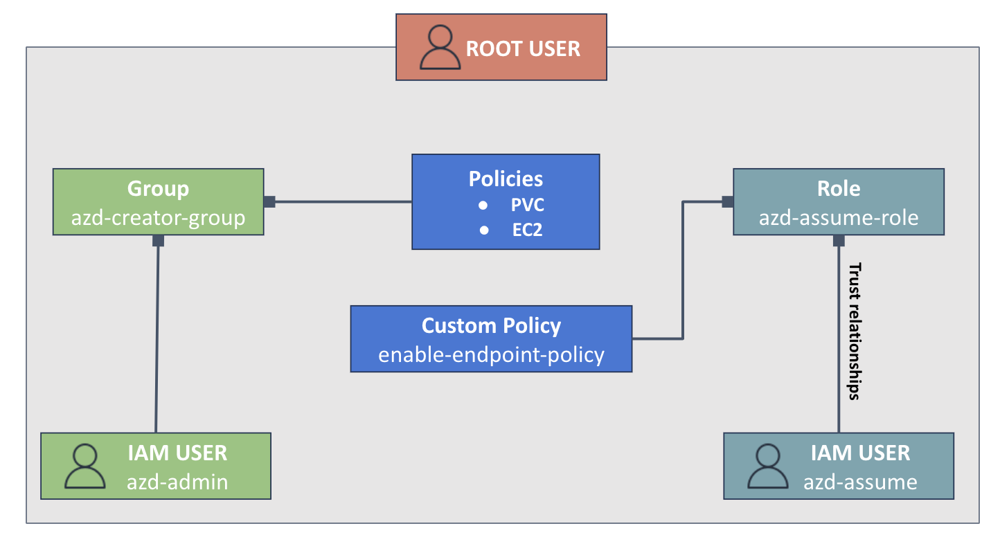

# aws-access-private-ec2

## Introduction
Public IP addresses have long been a convenient means for direct access to EC2 instances. However, as of February 1, 2024, AWS has introduced charges for public IPv4 addresses. This means that even small POC instances with Auto-Assigned Public IPs will incur charges. In light of this, alternative methods for accessing EC2 instances without relying on public IPs are being explored.

Refer : [New – AWS Public IPv4 Address Charge + Public IP Insights](https://aws.amazon.com/blogs/aws/new-aws-public-ipv4-address-charge-public-ip-insights/)

## EC2 Instance without public IPv4 

  

Creating a subnet within a VPC and launching EC2 instances in that subnet is considered a best practice for enhancing security. This approach ensures that the EC2 instances do not directly receive public IPv4 addresses. This is particularly advantageous when the instances running the application are not directly involved with or connected to end-users. In such scenarios, providing public IPv4 addresses to these instances is unnecessary, aligning with security best practices.

Accessing instances without public IPv4 addresses in private subnets requires additional configurations before able to access to EC2 instant in private subnet.

## Connect to your instances without requiring a public IPv4
AWS provides various methods to securely access EC2 instances in private subnets. The methods you mentioned are commonly used for different use cases such as \
`AWS VPN` Creates an encrypted tunnel over the internet, allowing private communication between your on-premises network and instances in the VPC.\
`Bastion Hosts` A bastion host is deployed in a public subnet with a public IP. Users connect to the bastion host first and then jump to private instances.\
`AWS Systems Manager Session Manager` Allows you to access instances without the need for direct public IP addresses. Accessible through the AWS Management Console, AWS CLI, or SDK.

However, all of the way above, there are pros and cons to the differences in use cases. For example, Bastion Host still needs a public IP and also needs to dedicate an additional instant to be an intermedia to connect to your target instant in a private subnet.

Therefore, AWS launched a new feature called `EC2 Instance Connect Endpoint Service` that can help you connect to your instant without a public IP, and there is no additional cost charge.

  

Refer : [Secure Connectivity from Public to Private: Introducing EC2 Instance Connect Endpoint](https://aws.amazon.com/blogs/compute/secure-connectivity-from-public-to-private-introducing-ec2-instance-connect-endpoint-june-13-2023/)

## Prerequisites before using the EC2 Instance Connect Endpoint Service

### IAM USER, Policy and Role

  

[Grant IAM permissions to use EC2 Instance Connect Endpoint](https://docs.aws.amazon.com/AWSEC2/latest/UserGuide/permissions-for-ec2-instance-connect-endpoint.html#iam-OpenTunnel)

[connect to an instance using the instance ID](https://docs.aws.amazon.com/AWSEC2/latest/UserGuide/ec2-instance-connect-methods.html#connect-linux-inst-eic-cli-ssh)

[Allow users to use EC2 Instance Connect Endpoint to connect to instances](https://docs.aws.amazon.com/AWSEC2/latest/UserGuide/permissions-for-ec2-instance-connect-endpoint.html#iam-CreateInstanceConnectEndpoint)

[Connect to your instances without requiring a public IPv4 address using EC2 Instance Connect Endpoint](https://docs.aws.amazon.com/AWSEC2/latest/UserGuide/connect-with-ec2-instance-connect-endpoint.html)
